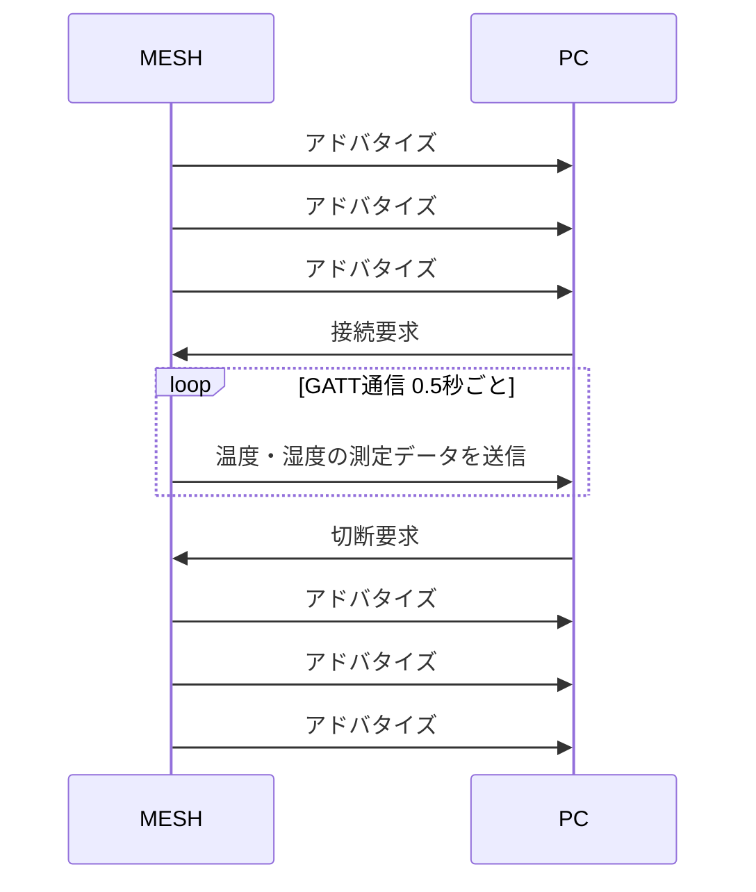

# Thermometer-Hygrometer
## アプリの特徴
ソニーが販売している IoT タグ MESH を利用して、温度・湿度を測定する。

## 開発の動機
**感染症対策・熱中症対策として、部屋の温度・湿度を測定したい**

「感染症対策・熱中症対策には温度と湿度の管理が大切」 ということはわかっていたが、実際の温度・湿度は把握していなかった。

単純に温度計・湿度計を購入して測定すればいいが、自動的に一定間隔で測定データを記録して、そのデータを可視化したり機械学習で活用できるのではないか。

また以前、BLE通信を利用してセンサと接続できる iOS アプリを開発するプロジェクトに参画していた。その際の内容を思い出すためにも、温度・湿度を測定できる iOS アプリの開発に挑戦した。

## 開発環境
**PC**
MacBook Air（2020,M1） メモリ：16GB ストレージ：1TB

**言語**
Swift

**フレームワーク**
SwiftUI

**MESH**
温度・湿度ブロック

- 測定できる温度の範囲： -10℃ 〜 50℃
- 測定できる湿度の範囲： 0% 〜 100%
- 充電： Micro-USB

https://meshprj.com/jp/products/blocks/MESH-100TH.html

## アプリの要件
- MESH 温度・湿度ブロック 1台と MacBook Air を BLE 通信を利用して接続する
- MESH 温度・湿度ブロックは接続後、0.5秒ごとに温度・湿度の測定データを PC に送信する
- iOS アプリで現在の温度と湿度を確認する
- 今回は　MacBook Air を**セントラル** MESH 温度・湿度ブロックを**ペリフェラル** とする（※セントラル・ペリフェルについては後述）

## BLE 通信
### BLEとは
- 近距離無線通信の規格 Bluetooth を省電力化した通信形式
- PC、スマートフォンなど通信の親機に相当する機器のことを **セントラル** と呼ぶ
- MESH や忘れ物防止タグなど通信の子機に相当する機器のことを **ペリフェラル** と呼ぶ

### BLE通信の流れ
※ 説明をわかりやすくするため、簡略化しています

1. ペリフェラルが通信待ちの状態では、周囲の不特定多数の機器を対象に無線信号を送信（**アドバタイズ**）
1. セントラルが**スキャン**を実行することで、アドバタイズを受信
1. セントラルが１対１で通信したいペリフェラルに対して、接続を要求
1. ペリフェラルがセントラルからの接続要求を受信し、１対１の通信（**GATT通信**）に切り替える
1. ペリフェラルからセントラルへ通信データを送信する ※
1. セントラルがペリフェラルに対して、切断を要求

**※ GATT 通信の特徴**
**サービス** と **キャラクタリスティック** の形で測定データをやり取りする

## 実際にアプリを動かす
Mac Book Air （M1） でアプリを実行し、MESH と接続すると、温度・湿度の値を表示することができた。

https://www.youtube.com/watch?v=IO9onsm9LBY

１日中動かすと、室内の湿度が１日で10〜20%前後変動することがわかった。特に、朝は感染症のリスクが高くなる**湿度40%以下**になる傾向があるため、部屋で洗濯物を干す・湯を沸かす等の対策が取れた。

（部屋のサイズや人数にもよるが、もしかしたら加湿器をわざわざ購入しなくても良いかも ... ）

### このアプリの使い所
- 感染症対策
- 熱中症対策
- ペットがいる家庭での温度管理
- 職場の温度・湿度管理

## 今後したいこと
- WidgetKit を利用して、アプリを立ち上げなくても温度・湿度を確認する。
- CoreData や Realm を利用して、測定したデータを永続化する。
- App Store でこのアプリを配信する。

## 参考資料

**MESH 技術ドキュメント**

MESH の操作方法・通信仕様がまとめられている。

https://developer.meshprj.com/hc/ja

**Qiita 記事**

https://qiita.com/tanakadaichi_1989/items/57fb3be60e6151421792
